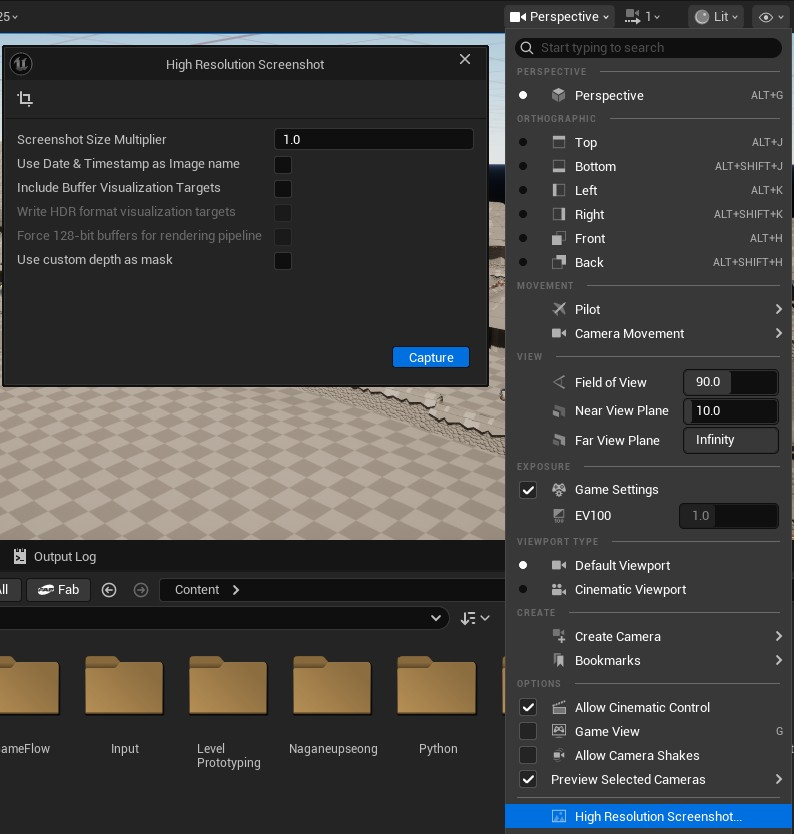
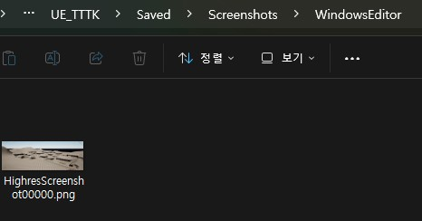

# Screenshot

- Unreal Engine에서 Thumbnail을 위한 Viewport Screenshot 찍는 법
- [taking-screenshots-in-unreal-engine](https://dev.epicgames.com/documentation/ko-kr/unreal-engine/taking-screenshots-in-unreal-engine)

### 1. Screenshot용 도구 열기

- 뷰포트 옵션`Viewport Option` -> 고해상도 스크린샷`High Resolution Screenshot` 클릭

### 2. Capture

- 캡쳐`Capture`를 눌러 현재 Viewport 화면을 Screenshot

### 3. 저장 위치

- `{PjtRoot}/Saved/Screenshots/{Platform}Editor/` 에 저장
- 해당 파일을 Editor에 드래그 & 드랍으로 Asset화